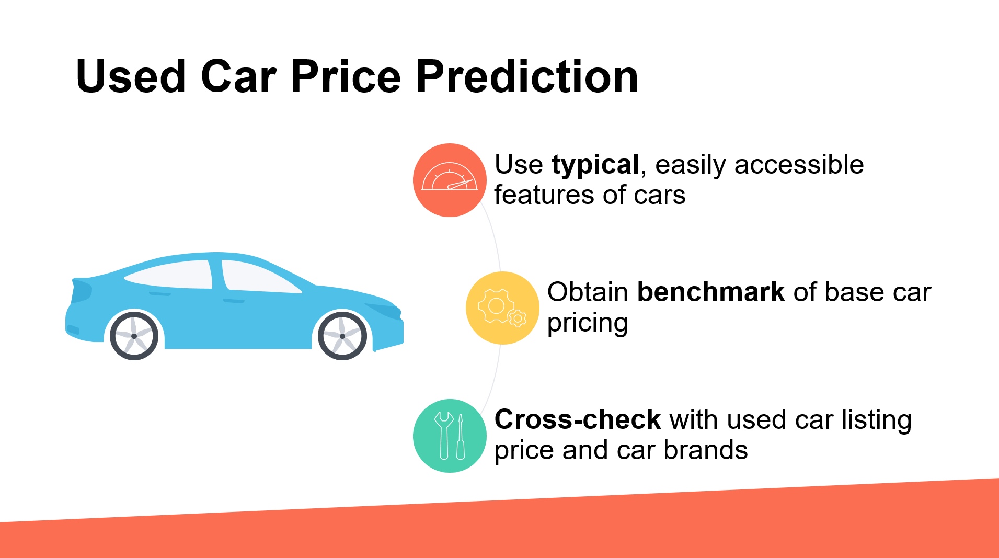
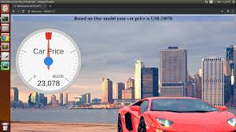

# Car-Price-Prediction
Project description-
In this project, we are taking the data set from Kaggle and apply some machine learning techniques 
for predicting the price of the car and after that we make a web APP with the help of flask and deploy on Heroku

By performing different ML models, we aim to get a better result or less error with max accuracy. Our purpose was
to predict the price of the used cars having 25 predictors and 509577 data entries.
Initially, data cleaning is performed to remove the null values and outliers from the dataset then ML models are 
implemented to predict the price of cars.

So, basically the main idea of this project is that we have some features of the car and how old it is from this data

 we have to predict the price of car in this present day.

 

 LIBREARY AND TOLLS - Pandas

                    - numpy

                    - matplotlib

                    - seaborn

                    - Flask

                    - HTML

                    - Sklearn
                
   
 
 
 If you want to check it out URL-https://carkiprice.herokuapp.com.
 ## All Thanks to -Krish Nike sir
                    
      

.........

